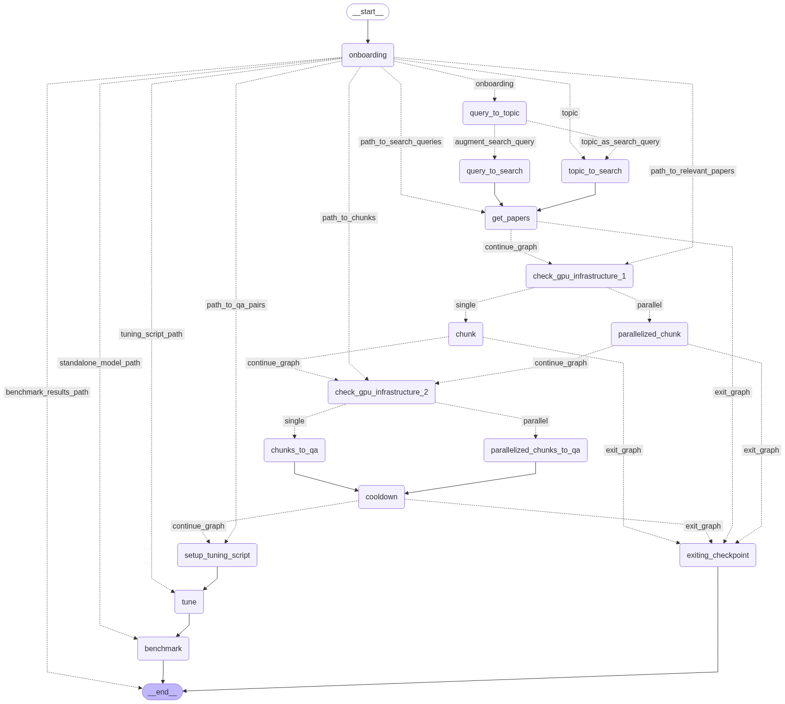

# TunedLLM

## Overview
The TunedLLM package is designed to create an automated parallelized agentic workflow which is able to take a user's query and transform it into a tuned LLM either through a retrieval system or through straightforwardly fine-tuning the chosen model. This package relies on Ollama, LangChain, LangGraph, and more. The setup would be the most complex part, but I will do my best to provide the best setup strategy.

## Features


- This package is able to perform the following:
    1. Infer the topic of the query and use the query and topic to create a search query for the CORE database to get relevant research papers. There is an optional step of creating multiple search queries regarding to cover more ground to search the database with.
    2. CORE database is queried with the search query(s) prepared in the previous node. This stage has retry logic and error handling to avoid faliure.
    3. The response retrieved from CORE is parsed and chunked where every chunk is given a "coherence score" which is provided by an agent.
        - The swarm.py is able to create a number of workers all doing the work at the same time based on the setup and infrastructure check. So this step can be parallelized.
    4. The top-scoring chunks are transformed into Q/A pairs making them ready for finetuning an LLM (TODO: or are transformed into chunks and their embeddings in an index for RAG systems)
        - Similar to the step above, swarm.py is able to create a number of LLM workers which execute this task in parallel.
    6. Using transformers and PyTorch an LLM is fine-tuned (PEFT).
    5. The finetuned model (TODO: or the RAG system) are evaluated and results are saved.

## Setup

Get API key from CORE database: https://core.ac.uk/services/api#what-is-included
Follow the instructions step by step and then save the api key string in .txt file called apikey.txt in your working directory.
```bash
    docker pull ollama/ollama
```
```bash
    docker run -d --gpus '"device=0"' -v ollama_gpu0:/root/.ollama -p 11434:11434 --name ollama_gpu0 ollama/ollama
    docker run -d --gpus '"device=1"' -v ollama_gpu1:/root/.ollama -p 11435:11434 --name ollama_gpu1 ollama/ollama
    docker run -d --gpus '"device=2"' -v ollama_gpu2:/root/.ollama -p 11436:11434 --name ollama_gpu2 ollama/ollama
    docker run -d --gpus '"device=3"' -v ollama_gpu3:/root/.ollama -p 11437:11434 --name ollama_gpu3 ollama/ollama
```

```bash
    docker exec -it ollama_gpu0 ollama pull gemma3:1b
    docker exec -it ollama_gpu1 ollama pull gemma3:1b
    docker exec -it ollama_gpu2 ollama pull gemma3:1b
    docker exec -it ollama_gpu3 ollama pull gemma3:1b
```
